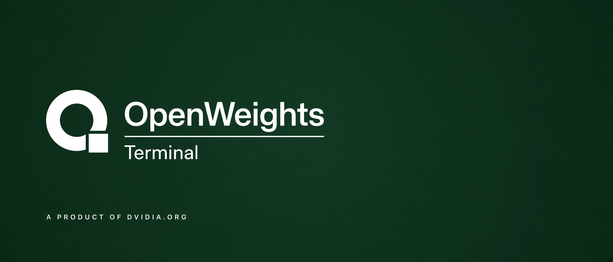

# Desk

This fork is the caller gateway for [OpenWeights Terminal](https://owterminal.com), a product of [dvidia.org](https://dvidia.org). Upstream remains [BerriAI/litellm](https://github.com/BerriAI/litellm). Our changes stay in `desk/` so the proxy can be merged forward.

LiteLLM holds the virtual key, the dollar budget, and the per-minute limit. The pool holds the machines. A host does not publish a URL. This proxy calls `OWT_API_BASE` once, with one pool key, and records what the caller owes.

A model is `owterminal/<id>`, the same id the desk board uses. A name with abliterated, heretic, uncensored, or jailbreak in it is $4 per million tokens. Anything else is $1. That price is the caller's bill. It is not the host's offer. The pool pays the host from the offer on the live machine. Retries are off, because a retry would open a second job.

## Run

```bash
cp desk/.env.example .env
# LITELLM_MASTER_KEY, DATABASE_URL, OWT_API_KEY
# OWT_API_BASE defaults to https://owterminal.com/api/v1
docker compose -f desk/compose.yaml up
```

The proxy file is `desk/proxy.yaml`. Upstream ignores any file named `config.yaml`, so that name cannot be committed.

```bash
python desk/pricing_test.py
```

## A key

```bash
curl -s http://localhost:4000/key/generate \
  -H "Authorization: Bearer $LITELLM_MASTER_KEY" \
  -H "Content-Type: application/json" \
  -d '{"max_budget":10,"budget_duration":"30d","rpm_limit":60,"models":["owterminal/*"]}'
```

`max_budget` is US dollars. The key stops when its spend row crosses it.

## A call

```bash
curl -s http://localhost:4000/v1/chat/completions \
  -H "Authorization: Bearer $VIRTUAL_KEY" \
  -H "Content-Type: application/json" \
  -d '{"model":"owterminal/qwen3.6-35b-a3b-abliterated","messages":[{"role":"user","content":"Say hi"}]}'
```

The gateway waits up to 95 seconds. Callers should set a 90 second timeout. If no machine claims the job, the pool returns an error and this proxy does not try again.

## Where this sits

[dvidia.org](https://dvidia.org) is the house. [OpenWeights Terminal](https://owterminal.com) is the desk: the boards, and the pool that keeps the ledger and the queue. This fork is only the front door for callers who need a team key, a dollar budget, and a per-minute limit.

There are two LiteLLM processes, and they are not the same one.

| | This fork | LiteLLM on a GPU box |
|---|---|---|
| Who runs it | Us, when the gateway is up | The person who owns the machine |
| Who it faces | A developer, with a virtual key | The pool worker on that same box |
| What it calls | `https://owterminal.com/api/v1`, once, with one pool key | The weights on the DGX |
| What it must not do | Pick a machine, or retry | Join the pool by itself |

A call moves like this.

```text
developer
  → this fork            virtual key, budget, requests per minute
  → owterminal.com/api/v1
  → the cheapest live machine for that model
  → pool-worker on that box
  → that box's own LiteLLM, or the engine itself
  → the GPU
```

The worker is [scripts/pool-worker.mjs](https://github.com/Tarzelf/ow-terminal/blob/main/scripts/pool-worker.mjs) in the desk repo. It claims a job and calls the local LiteLLM with `LITELLM_KEY`. It does not call this fork. Pointing a DGX at `desk/proxy.yaml` would send the job back into the pool.

Two prices, on purpose. This fork bills the caller $4 per million tokens when the name is abliterated, heretic, uncensored, or jailbreak, and $1 otherwise. The pool pays the host 80 percent of the offer that machine posted. Those amounts are not the same number. The gap is the margin. The host's LiteLLM does not set either of them.

`dvidia-cli` is the reserved place for a host installer and a wallet. The repository is empty, so it is not on this path. A machine joins with the worker, or from the browser on [the app](https://owterminal.com/app).

This gateway has no public hostname yet. Until `desk/compose.yaml` is running somewhere reachable, callers use the pool key directly. The rest of the path is written in [how the desk works](https://github.com/Tarzelf/ow-terminal/blob/main/docs/how-it-works.md).

